# AgentOS Studio Strands - System Architecture Documentation

## 🏗️ System Architecture Overview

AgentOS Studio Strands implements a sophisticated multi-agent orchestration system with the following architectural principles:

- **Microservices Architecture**: Loosely coupled services with clear responsibilities
- **Event-Driven Communication**: Asynchronous agent coordination
- **Layered Design**: Clear separation between presentation, business logic, and data layers
- **Scalable Design**: Horizontal scaling capabilities for high-load scenarios

## 🔄 Core Architecture Components

### 1. Frontend Layer (React)

```
src/
├── components/
│   ├── A2A/
│   │   ├── MainSystemOrchestratorCard.tsx    # Primary orchestration interface
│   │   ├── A2AOrchestrationMonitor.tsx       # Real-time monitoring
│   │   ├── ObservabilityPanel.tsx            # System health dashboard
│   │   └── ConversationLineage.tsx           # Interaction tracking
│   └── ui/                                   # Reusable UI components
├── lib/
│   └── services/
│       ├── A2AService.ts                     # A2A communication service
│       ├── UnifiedOrchestrationService.ts    # Orchestration coordination
│       └── StrandsSdkService.ts              # Tool integration service
└── pages/                                    # Route components
```

### 2. Backend Services Layer

#### Main System Orchestrator (Port 5031)
- **File**: `backend/main_system_orchestrator.py`
- **Purpose**: Central orchestration engine
- **Responsibilities**:
  - Query analysis and task decomposition
  - Agent selection and scoring
  - Multi-agent coordination
  - Response synthesis and formatting
  - Session management

#### A2A Service (Port 5008)
- **File**: `backend/a2a_service.py`
- **Purpose**: Agent-to-Agent communication hub
- **Responsibilities**:
  - Agent registration and discovery
  - Handover management
  - Conversation lineage tracking
  - Performance metrics collection
  - Agent health monitoring

#### Ollama API Wrapper (Port 5002)
- **File**: `backend/ollama_api.py`
- **Purpose**: LLM integration wrapper
- **Responsibilities**:
  - Model management and selection
  - Agent creation and execution
  - Response generation
  - Health monitoring
  - Token usage tracking

#### Strands SDK Integration (Port 5006)
- **File**: `backend/strands_sdk_api.py`
- **Purpose**: Tool integration framework
- **Responsibilities**:
  - Tool registration and discovery
  - Execution management
  - Workflow template management
  - Custom tool support

### 3. Data Layer

#### Database Schema
```sql
-- Agents Registry
CREATE TABLE agents (
    id TEXT PRIMARY KEY,
    name TEXT NOT NULL,
    role TEXT,
    description TEXT,
    model TEXT NOT NULL,
    capabilities TEXT,
    system_prompt TEXT,
    temperature REAL DEFAULT 0.7,
    max_tokens INTEGER DEFAULT 1000,
    created_at TIMESTAMP DEFAULT CURRENT_TIMESTAMP,
    updated_at TIMESTAMP DEFAULT CURRENT_TIMESTAMP
);

-- Conversation History
CREATE TABLE conversations (
    id TEXT PRIMARY KEY,
    agent_id TEXT NOT NULL,
    messages TEXT,
    created_at TIMESTAMP DEFAULT CURRENT_TIMESTAMP,
    updated_at TIMESTAMP DEFAULT CURRENT_TIMESTAMP,
    FOREIGN KEY (agent_id) REFERENCES agents (id)
);

-- Execution Logs
CREATE TABLE executions (
    id TEXT PRIMARY KEY,
    agent_id TEXT NOT NULL,
    input_text TEXT NOT NULL,
    output_text TEXT,
    success BOOLEAN DEFAULT FALSE,
    duration INTEGER,
    tokens_used INTEGER,
    error_message TEXT,
    timestamp TIMESTAMP DEFAULT CURRENT_TIMESTAMP,
    FOREIGN KEY (agent_id) REFERENCES agents (id)
);

-- Orchestration Sessions
CREATE TABLE orchestration_sessions (
    session_id TEXT PRIMARY KEY,
    query TEXT NOT NULL,
    agents_involved TEXT,
    status TEXT,
    results TEXT,
    created_at TIMESTAMP DEFAULT CURRENT_TIMESTAMP,
    updated_at TIMESTAMP DEFAULT CURRENT_TIMESTAMP
);
```

## 🔄 System Workflow Architecture

### 1. Query Processing Pipeline

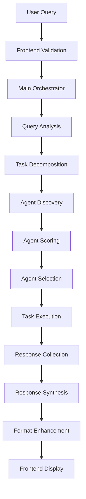

### 2. Multi-Agent Coordination Flow

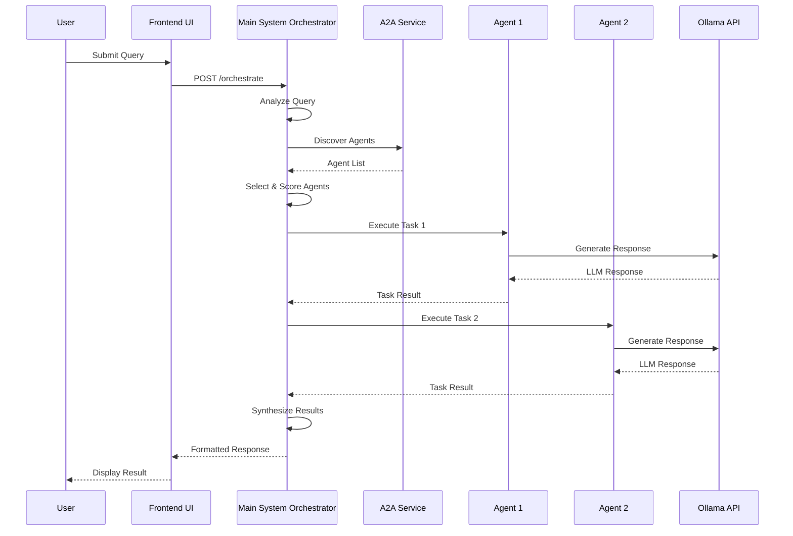

### 3. Response Formatting Pipeline

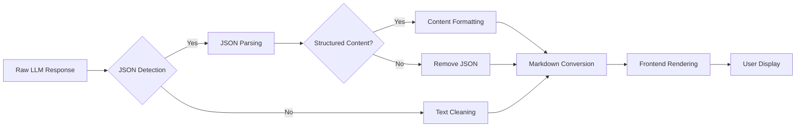

## 🛠️ Service Communication Architecture

### 1. Inter-Service Communication

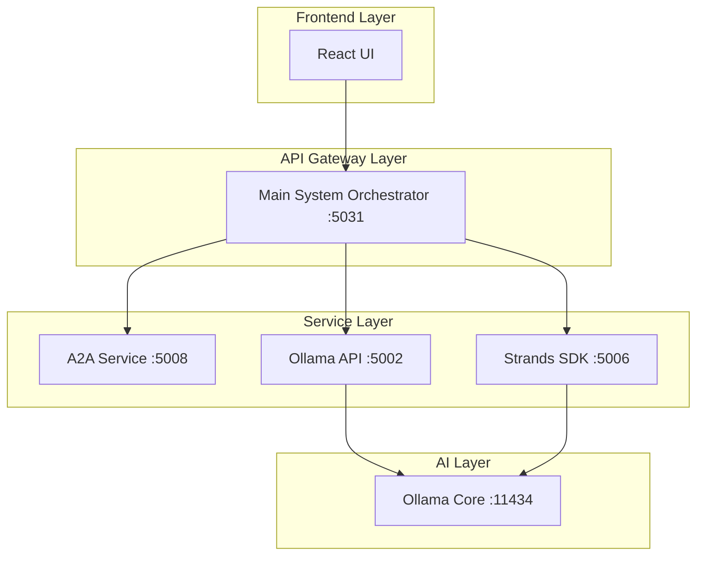

### 2. Data Flow Architecture

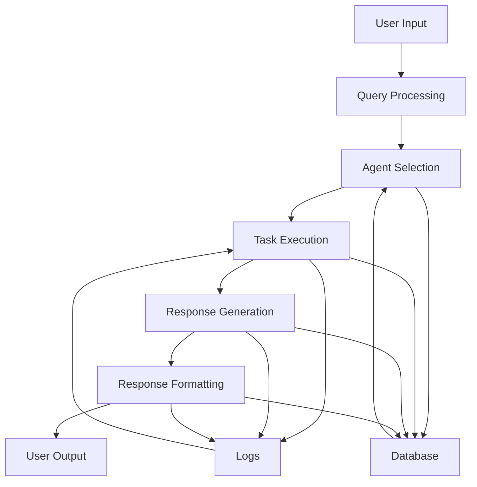

## 🔧 Configuration Architecture

### 1. Environment Configuration

```bash
# Core Service Configuration
MAIN_ORCHESTRATOR_PORT=5031
A2A_SERVICE_PORT=5008
OLLAMA_API_PORT=5002
STRANDS_SDK_PORT=5006
OLLAMA_BASE_URL=http://localhost:11434

# Model Configuration
ORCHESTRATOR_MODEL=qwen3:1.7b
DEFAULT_TEMPERATURE=0.7
DEFAULT_MAX_TOKENS=1000

# Database Configuration
DATABASE_PATH=ollama_agents.db
LOG_LEVEL=INFO

# Security Configuration
CORS_ENABLED=true
RATE_LIMIT_ENABLED=true
```

### 2. Service Discovery Architecture

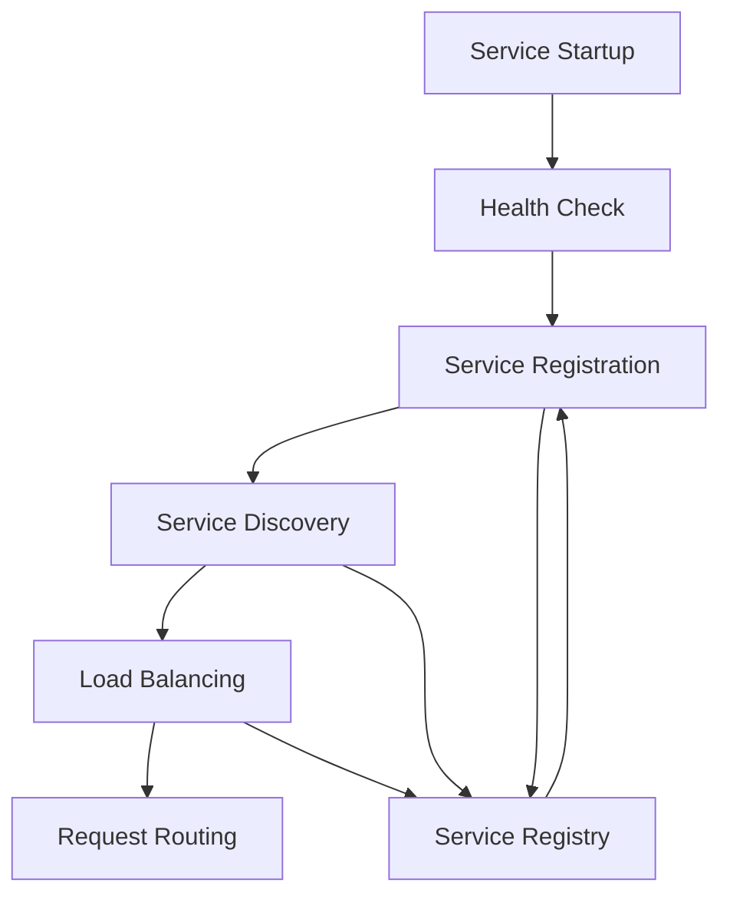

## 📊 Monitoring & Observability Architecture

### 1. Metrics Collection Architecture

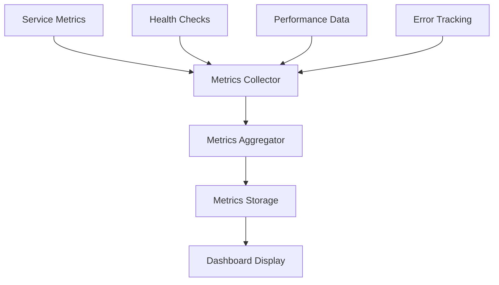

### 2. Logging Architecture

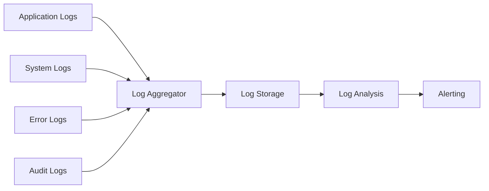

## 🔒 Security Architecture

### 1. Security Layers

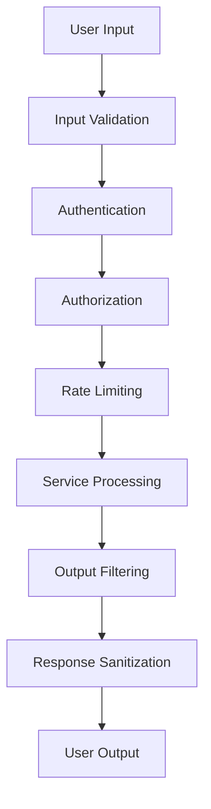

### 2. Data Protection

- **Input Validation**: All user inputs are validated and sanitized
- **SQL Injection Prevention**: Parameterized queries throughout
- **XSS Protection**: Output encoding and sanitization
- **CORS Configuration**: Proper cross-origin resource sharing
- **Rate Limiting**: Request throttling to prevent abuse

## 🚀 Deployment Architecture

### 1. Development Environment

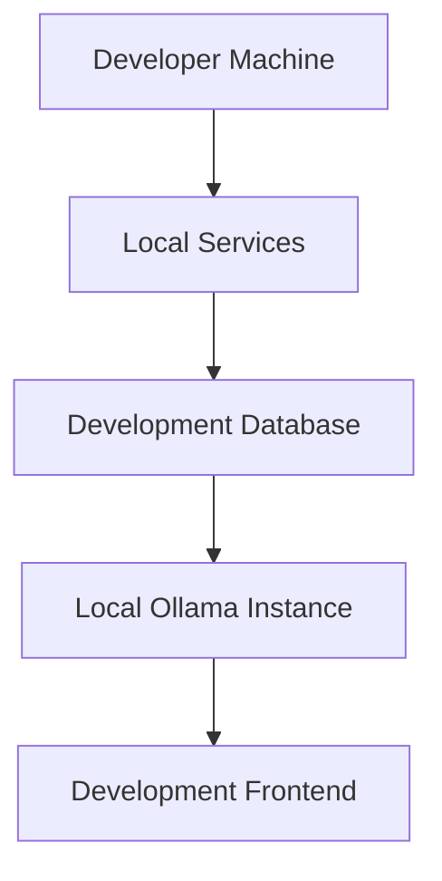

### 2. Production Environment

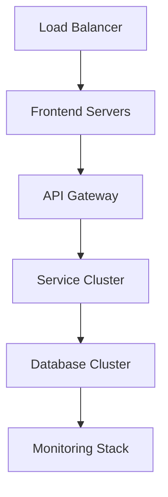

## 🔄 Scalability Architecture

### 1. Horizontal Scaling

- **Stateless Services**: All services are stateless for easy scaling
- **Load Balancing**: Request distribution across multiple instances
- **Database Sharding**: Horizontal database scaling
- **Caching Layer**: Redis for performance optimization

### 2. Performance Optimization

- **Connection Pooling**: Database connection optimization
- **Response Caching**: Frequently accessed data caching
- **Async Processing**: Non-blocking operations
- **Resource Monitoring**: Continuous performance tracking

## 📈 Future Architecture Considerations

### 1. Microservices Evolution

- **Service Mesh**: Istio for advanced service communication
- **Container Orchestration**: Kubernetes for production deployment
- **API Gateway**: Kong or Ambassador for advanced routing
- **Event Streaming**: Apache Kafka for event-driven architecture

### 2. AI/ML Integration

- **Model Serving**: Dedicated model serving infrastructure
- **A/B Testing**: Model performance comparison
- **Continuous Learning**: Model retraining pipelines
- **Feature Stores**: Centralized feature management

---

This architecture documentation provides a comprehensive overview of the AgentOS Studio Strands system design, enabling developers to understand the system structure and contribute effectively to the project.