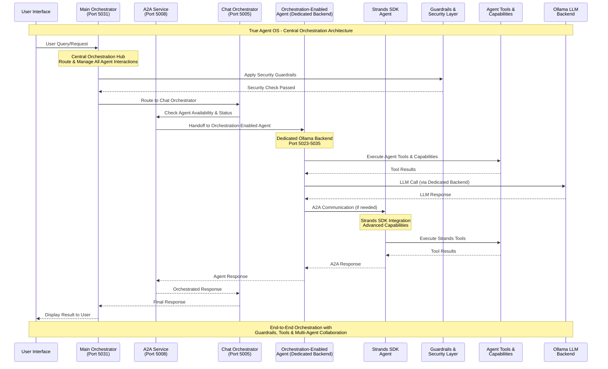
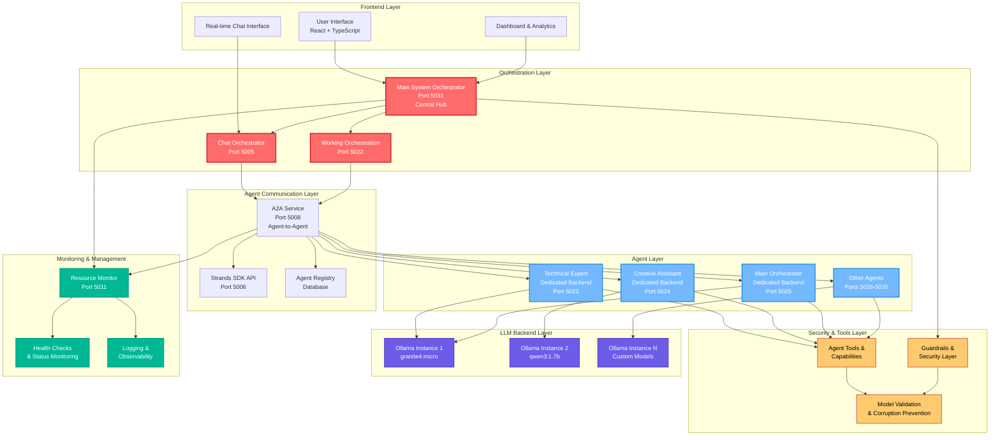

# True Agent OS - Advanced AI Agent Orchestration Platform


**True Agent OS** is a comprehensive AI agent orchestration platform designed for enterprise operations, featuring advanced multi-agent collaboration, real-time orchestration, and industry-specific workflows.

## 🚀 **Key Features**

### **Core Platform**
- **Multi-Agent Orchestration**: Seamless agent-to-agent communication and collaboration
- **Real-Time Chat Interface**: Interactive chat with AI agents featuring full response display
- **Industry-Specific Workflows**: Tailored solutions for Telecommunications, Banking, Healthcare, and Industrial sectors
- **Advanced Observability**: Comprehensive monitoring, tracing, and analytics
- **Strands SDK Integration**: Official integration with Strands SDK for enhanced agent capabilities

### **True Agent OS Branding**
- **Custom Logo**: Red-to-purple gradient "true" logo with modern design
- **Dynamic Theming**: Industry-aware color schemes and branding
- **Responsive UI**: Modern React-based interface with dark theme
- **Professional Dashboard**: Enterprise-grade user experience

### **Agent Management**
- **A2A Communication**: Agent-to-Agent communication with dedicated backends
- **Orchestration Registration**: One-click agent registration for multi-agent collaboration
- **Performance Metrics**: Real-time agent performance monitoring
- **Connection Management**: Visual agent connection status and management

### **Backend Services**
- **Ollama Integration**: Full Ollama backend support with multiple models
- **Service Orchestration**: Comprehensive backend service management
- **Database Management**: SQLite-based agent and communication persistence
- **Health Monitoring**: Real-time service health checks and status monitoring

## 🏗️ **Architecture**

### **True Agent OS - Central Orchestration Flow**



### **System Architecture Overview**



### **Frontend (React + TypeScript)**
```
src/
├── components/           # React components
│   ├── A2A/            # Agent-to-Agent components
│   ├── CommandCentre/  # Command center interface
│   ├── MultiAgentWorkspace/ # Multi-agent collaboration
│   └── ui/             # UI components
├── contexts/           # React contexts
├── hooks/              # Custom React hooks
├── lib/               # Utility libraries
└── pages/             # Page components
```

### **Backend (Python + Flask)**
```
backend/
├── a2a_service.py              # A2A communication service
├── main_system_orchestrator.py # Main orchestration service
├── chat_orchestrator_api.py    # Chat orchestration API
├── strands_orchestration_api.py # Strands SDK integration
├── resource_monitor_api.py     # Resource monitoring
└── services/                   # Additional services
    └── utility_agents/         # Utility agent services
```

### **Orchestration Flow Explanation**

The True Agent OS architecture follows a sophisticated orchestration pattern where the **Main System Orchestrator** (Port 5031) serves as the central hub for all AI agent interactions:

#### **1. Central Orchestration Hub**
- **Main System Orchestrator** acts as the primary entry point and routing engine
- Manages all incoming user requests and determines optimal agent routing
- Implements intelligent load balancing and failover mechanisms
- Coordinates multi-agent workflows and handoffs

#### **2. Security & Guardrails Layer**
- **Guardrails** are applied at the orchestration level before any agent processing
- Security checks include content filtering, PII detection, and access control
- Model validation prevents corruption and ensures response quality
- All agent interactions are monitored and logged for compliance

#### **3. Agent-to-Agent Communication (A2A)**
- **A2A Service** (Port 5008) enables seamless agent collaboration
- Orchestration-enabled agents have dedicated Ollama backends (Ports 5023-5035)
- Agents can communicate directly with each other for complex workflows
- Real-time status monitoring and connection management

#### **4. Tool Execution & Capabilities**
- Each agent has access to specialized tools and capabilities
- Tools are executed within the agent's dedicated backend environment
- Strands SDK integration provides advanced agent capabilities
- Tool results are validated and integrated into the orchestration flow

#### **5. Multi-Agent Collaboration**
- Agents can hand off tasks to other specialized agents
- Complex workflows are broken down and distributed across multiple agents
- Real-time coordination ensures seamless user experience
- End-to-end traceability for debugging and optimization

#### **6. Monitoring & Observability**
- **Resource Monitor** (Port 5011) tracks all system components
- Health checks ensure service availability and performance
- Comprehensive logging provides full observability
- Performance metrics enable continuous optimization

## 🛠️ **Installation & Setup**

### **Prerequisites**
- Node.js 18+ and npm
- Python 3.12+
- Ollama (for AI models)
- Git

### **Quick Start**
```bash
# Clone the repository
git clone https://github.com/ashfrnndz21/AgentOS_Oct_181025.git
cd AgentOS_Oct_181025

# Install frontend dependencies
npm install

# Install Python dependencies
pip install -r requirements.txt

# Start all services
./start-all-services.sh

# Start frontend development server
npm run dev
```

### **Service Ports**
- **Frontend**: http://localhost:5173
- **Main Orchestrator**: http://localhost:5031
- **A2A Service**: http://localhost:5008
- **Chat Orchestrator**: http://localhost:5005
- **Resource Monitor**: http://localhost:5011
- **Strands SDK**: http://localhost:5006

## 🎯 **Use Cases**

### **Telecommunications**
- Network Twin management
- Customer Analytics
- Network Optimization
- Service Quality Management

### **Banking & Finance**
- Risk Analytics
- Wealth Management
- Customer Insights
- Fraud Detection

### **Healthcare**
- Patient Analytics
- Care Management
- Medical Research
- Treatment Optimization

### **Industrial**
- Procurement Analytics
- Safety Monitoring
- R&D Discovery
- Talent Management

## 🔧 **Configuration**

### **Industry Configuration**
The platform supports multiple industry configurations with custom branding and workflows:

```typescript
// Industry configurations in src/contexts/IndustryContext.tsx
const industryConfigurations = [
  {
    id: 'true',
    displayName: 'True Agent OS',
    primaryColor: 'hsl(300, 100%, 50%)',
    accentColor: 'hsl(0, 100%, 50%)',
    // ... additional configuration
  }
];
```

### **Agent Configuration**
Agents can be configured with specific models, capabilities, and orchestration settings:

```python
# Agent configuration in backend
agent_config = {
    "name": "Technical Expert",
    "model": "granite4:micro",
    "orchestration_enabled": True,
    "capabilities": ["technical", "general"]
}
```

## 📊 **Monitoring & Observability**

### **Service Health Monitoring**
- Real-time service status monitoring
- Port allocation and resource usage tracking
- Automatic health checks and recovery

### **Agent Performance Analytics**
- Execution time tracking
- Success rate monitoring
- Tool usage analytics
- Connection status monitoring

### **System Metrics**
- Memory usage monitoring
- CPU utilization tracking
- Database performance metrics
- Network connectivity status

## 🤝 **Contributing**

We welcome contributions to True Agent OS! Please see our [Contributing Guide](CONTRIBUTING.md) for details.

### **Development Workflow**
1. Fork the repository
2. Create a feature branch
3. Make your changes
4. Test thoroughly
5. Submit a pull request

## 📝 **Documentation**

- [Architecture Overview](ARCHITECTURE.md)
- [API Documentation](API_DOCUMENTATION.md)
- [User Workflow Guide](USER_WORKFLOW_BUILDING_EXPERIENCE.md)
- [A2A Integration Guide](A2A_INTEGRATION_README.md)
- [Strands SDK Integration](STRANDS_SDK_AGENT_CREATION_STRATEGY.md)

## 🐛 **Troubleshooting**

### **Common Issues**
- **Service Startup Issues**: Check port availability and dependencies
- **Agent Registration Failures**: Verify Ollama installation and model availability
- **Frontend White Screen**: Check browser console for JavaScript errors
- **Database Issues**: Verify SQLite database permissions and integrity

### **Debug Commands**
```bash
# Check service status
./check-services-status.sh

# View service logs
./view-backend-logs.sh

# Test agent integration
./test-agent-integration.sh
```

## 📄 **License**

This project is licensed under the MIT License - see the [LICENSE](LICENSE) file for details.

## 🙏 **Acknowledgments**

- **Ollama** for providing the AI model infrastructure
- **Strands SDK** for advanced agent capabilities
- **React** and **TypeScript** for the frontend framework
- **Flask** for the backend API framework

## 📞 **Support**

For support and questions:
- Create an issue in this repository
- Check the documentation in the `/docs` folder
- Review the troubleshooting guide

---

**True Agent OS** - Empowering enterprise AI operations with advanced agent orchestration and collaboration capabilities.

*Built with ❤️ for the future of AI agent collaboration*