# AgentOS Studio Strands - System Workflow Documentation

## 🔄 System Workflow Overview

The AgentOS Studio Strands system implements sophisticated workflows for multi-agent orchestration, query processing, and response generation. This document details the complete workflow architecture and execution patterns.

## 📋 Core Workflow Components

### 1. Query Processing Workflow

#### Phase 1: Query Reception and Validation


**Process Steps:**
1. **User Input**: Query submitted through MainSystemOrchestratorCard
2. **Frontend Validation**: Client-side input validation and sanitization
3. **Request Formatting**: JSON payload preparation with metadata
4. **API Routing**: Request routed to Main System Orchestrator (Port 5031)
5. **Service Reception**: Orchestrator receives and validates request

#### Phase 2: Query Analysis and Task Decomposition


**Process Steps:**
1. **LLM Analysis**: Query analyzed using Qwen3:1.7b model
2. **Domain Classification**: Creative, technical, analytical, or multi-domain
3. **Complexity Assessment**: Simple, moderate, or complex task classification
4. **Task Decomposition**: Breaking down complex queries into manageable tasks
5. **Workflow Pattern**: Single-agent, multi-agent, or sequential pattern detection
6. **Agent Requirements**: Determining required capabilities and expertise

#### Phase 3: Agent Discovery and Selection


**Process Steps:**
1. **Agent Discovery**: Query A2A Service for available agents
2. **Capability Matching**: Match agent capabilities to task requirements
3. **Scoring Algorithm**: Score agents based on relevance, domain match, and suitability
4. **Selection Logic**: Select optimal agents for task execution
5. **Coordination Strategy**: Determine sequential or parallel execution
6. **Task Assignment**: Assign specific tasks to selected agents

### 2. Multi-Agent Execution Workflow

#### Sequential Execution Pattern


#### Parallel Execution Pattern

```mermaid
sequenceDiagram
    participant MSO as Main Orchestrator
    participant A1 as Agent 1
    participant A2 as Agent 2
    participant OLLAMA as Ollama API
    
    par Parallel Execution
        MSO->>A1: Execute Task 1
        A1->>OLLAMA: Generate Response
    and
        MSO->>A2: Execute Task 2
        A2->>OLLAMA: Generate Response
    end
    OLLAMA-->>A1: LLM Response
    OLLAMA-->>A2: LLM Response
    A1-->>MSO: Task 1 Result
    A2-->>MSO: Task 2 Result
    MSO->>MSO: Synthesize Results
```


### 3. Response Processing Workflow

#### Response Generation Pipeline


**Process Steps:**
1. **Agent Execution**: Selected agents execute assigned tasks
2. **LLM Generation**: Ollama generates responses using appropriate models
3. **Response Validation**: Validate response quality and completeness
4. **Quality Assessment**: Score response quality and relevance
5. **Content Extraction**: Extract meaningful content from responses
6. **Response Collection**: Collect all agent responses
7. **Synthesis Preparation**: Prepare responses for final synthesis

#### Response Formatting Pipeline


**Process Steps:**
1. **JSON Detection**: Identify structured content in responses
2. **Content Parsing**: Parse JSON for structured data (poems, data, etc.)
3. **Format Conversion**: Convert structured content to display format
4. **Text Cleaning**: Remove technical artifacts and metadata
5. **Markdown Processing**: Convert to markdown for rich display
6. **Frontend Rendering**: Render formatted content in UI
7. **User Display**: Present final formatted response to user

## 🔄 Advanced Workflow Patterns

### 1. Reflective Orchestration Workflow


**Key Features:**
- **Iterative Improvement**: Continuous quality assessment and improvement
- **Adaptive Execution**: Dynamic adjustment based on intermediate results
- **Quality Gates**: Multiple checkpoints for response quality
- **Retry Mechanisms**: Automatic retry for failed executions

### 2. Context-Aware Handover Workflow


**Key Features:**
- **Context Preservation**: Maintain context across agent handovers
- **Seamless Transitions**: Smooth agent-to-agent transitions
- **Context Enrichment**: Enhance context with each handover
- **State Management**: Track execution state across agents

### 3. Observability Workflow


**Key Features:**
- **Real-time Monitoring**: Continuous system health monitoring
- **Performance Tracking**: Detailed execution metrics
- **Conversation Lineage**: Complete interaction tracking
- **Alert System**: Proactive issue detection and notification

## 🛠️ Workflow Configuration

### 1. Execution Configuration

```python
# Workflow execution configuration
WORKFLOW_CONFIG = {
    "max_execution_time": 300,  # 5 minutes
    "max_retries": 3,
    "quality_threshold": 0.8,
    "parallel_execution_limit": 3,
    "context_preservation": True,
    "observability_enabled": True
}
```

### 2. Agent Selection Configuration

```python
# Agent selection configuration
AGENT_SELECTION_CONFIG = {
    "scoring_weights": {
        "domain_match": 0.4,
        "capability_match": 0.3,
        "task_suitability": 0.2,
        "performance_history": 0.1
    },
    "minimum_score": 0.7,
    "max_agents_per_task": 3,
    "fallback_agent": "Main System Orchestrator"
}
```

### 3. Response Formatting Configuration

```python
# Response formatting configuration
FORMATTING_CONFIG = {
    "json_detection_enabled": True,
    "poem_formatting": True,
    "data_formatting": True,
    "markdown_conversion": True,
    "technical_artifact_removal": True,
    "metadata_extraction": True
}
```

## 📊 Workflow Metrics and Monitoring

### 1. Execution Metrics

- **Query Processing Time**: Time from query submission to response
- **Agent Selection Time**: Time for agent discovery and selection
- **Execution Time**: Time for agent task execution
- **Synthesis Time**: Time for response synthesis and formatting
- **Total Response Time**: End-to-end response time

### 2. Quality Metrics

- **Response Quality Score**: LLM-assessed response quality
- **Task Completion Rate**: Percentage of successfully completed tasks
- **Agent Success Rate**: Individual agent performance metrics
- **User Satisfaction**: User feedback and interaction metrics

### 3. System Metrics

- **Resource Utilization**: CPU, memory, and network usage
- **Service Health**: Individual service health status
- **Error Rates**: Failure rates across different components
- **Throughput**: Requests processed per unit time

## 🔄 Workflow Optimization Strategies

### 1. Performance Optimization

- **Caching**: Response caching for frequently asked queries
- **Parallel Processing**: Concurrent agent execution where possible
- **Connection Pooling**: Optimized database connections
- **Resource Management**: Efficient resource allocation and cleanup

### 2. Quality Optimization

- **Iterative Refinement**: Continuous improvement through feedback
- **Quality Gates**: Multiple checkpoints for response validation
- **Adaptive Selection**: Dynamic agent selection based on performance
- **Context Enhancement**: Improved context preservation and enrichment

### 3. Reliability Optimization

- **Error Handling**: Comprehensive error handling and recovery
- **Retry Mechanisms**: Automatic retry for transient failures
- **Circuit Breakers**: Protection against cascading failures
- **Health Monitoring**: Proactive system health monitoring

## 🚀 Future Workflow Enhancements

### 1. Advanced Orchestration

- **Dynamic Workflow Generation**: AI-generated workflow patterns
- **Adaptive Execution**: Self-optimizing execution strategies
- **Predictive Scaling**: Anticipatory resource scaling
- **Intelligent Routing**: AI-powered request routing

### 2. Enhanced Observability

- **Distributed Tracing**: End-to-end request tracing
- **Real-time Analytics**: Live performance analytics
- **Predictive Monitoring**: AI-powered failure prediction
- **Automated Remediation**: Self-healing system capabilities

### 3. Advanced Agent Coordination

- **Swarm Intelligence**: Collective agent decision making
- **Emergent Behavior**: Self-organizing agent behaviors
- **Dynamic Team Formation**: Adaptive agent team creation
- **Cross-Domain Learning**: Knowledge transfer between agents

---

This workflow documentation provides comprehensive details about the AgentOS Studio Strands system workflows, enabling developers to understand and optimize the execution patterns for enhanced performance and reliability.
