# AgentOS Studio Strands - Architecture Diagrams

## 🏗️ System Architecture

### High-Level Architecture

### Component Architecture

### Service Communication Flow

## 🔄 Data Flow Architecture

### Request Processing Flow

### Agent Selection Process

## 🎯 Agent Ecosystem Architecture

### Agent Types and Capabilities

```mermaid
graph TB
    subgraph "Agent Categories"
        subgraph "Data Agents"
            WA[Weather Agent<br/>🌤️ Weather Data]
            DA[Data Agent<br/>📊 Analytics]
        end
        
        subgraph "Creative Agents"
            CA[Creative Assistant<br/>🎨 Content Creation]
            PA[Poetry Agent<br/>📝 Creative Writing]
        end
        
        subgraph "Technical Agents"
            CalA[Calculator Agent<br/>🧮 Math Operations]
            TA[Technical Agent<br/>⚙️ Technical Tasks]
        end
        
        subgraph "Custom Agents"
            UA[User Defined<br/>🔧 Custom Logic]
            IA[Integration Agent<br/>🔗 External APIs]
        end
    end
    
    subgraph "Agent Capabilities"
        C1[General Capabilities]
        C2[Domain Expertise]
        C3[Specialized Skills]
        C4[Integration Abilities]
    end
    
    WA --> C1
    WA --> C2
    CA --> C1
    CA --> C3
    CalA --> C1
    CalA --> C3
    UA --> C4
    IA --> C4
```

### A2A Communication Protocol

## 📊 Monitoring and Observability Architecture

### Health Monitoring System

## 🔧 Configuration Architecture

### Configuration Management

---

*These diagrams provide a comprehensive view of the AgentOS Studio Strands architecture, showing how all components interact and work together to enable sophisticated multi-agent orchestration.*