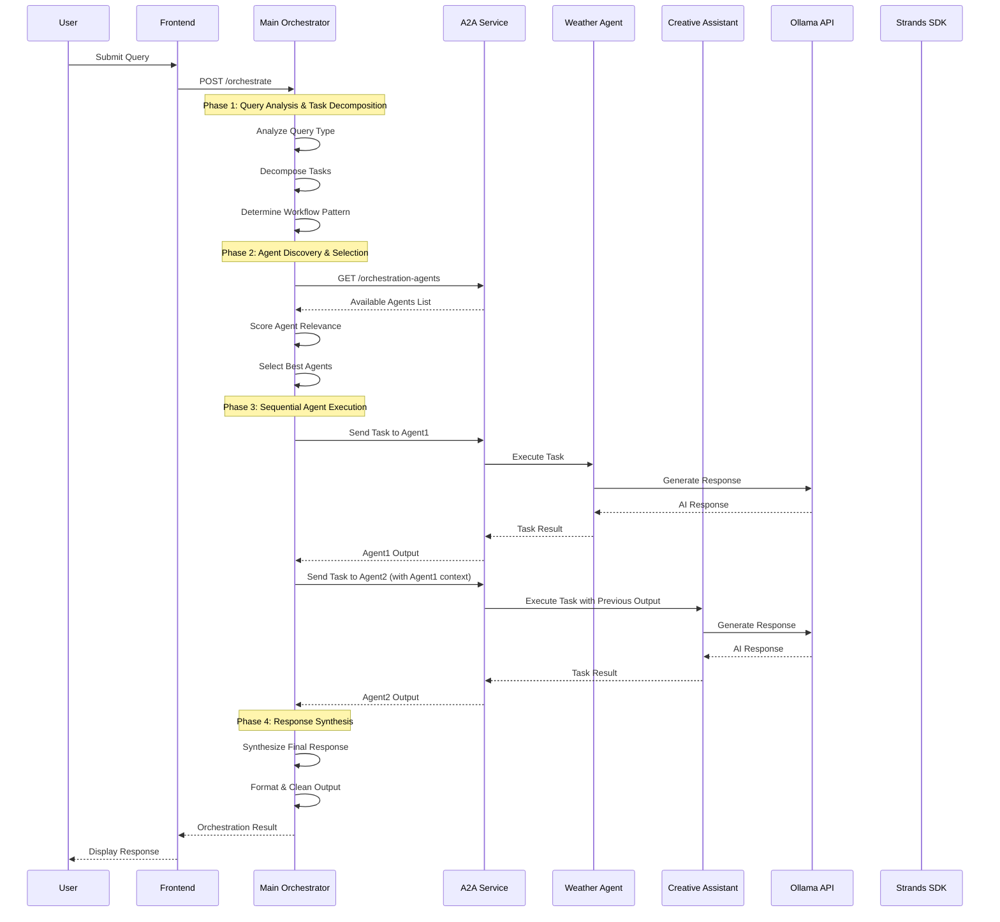
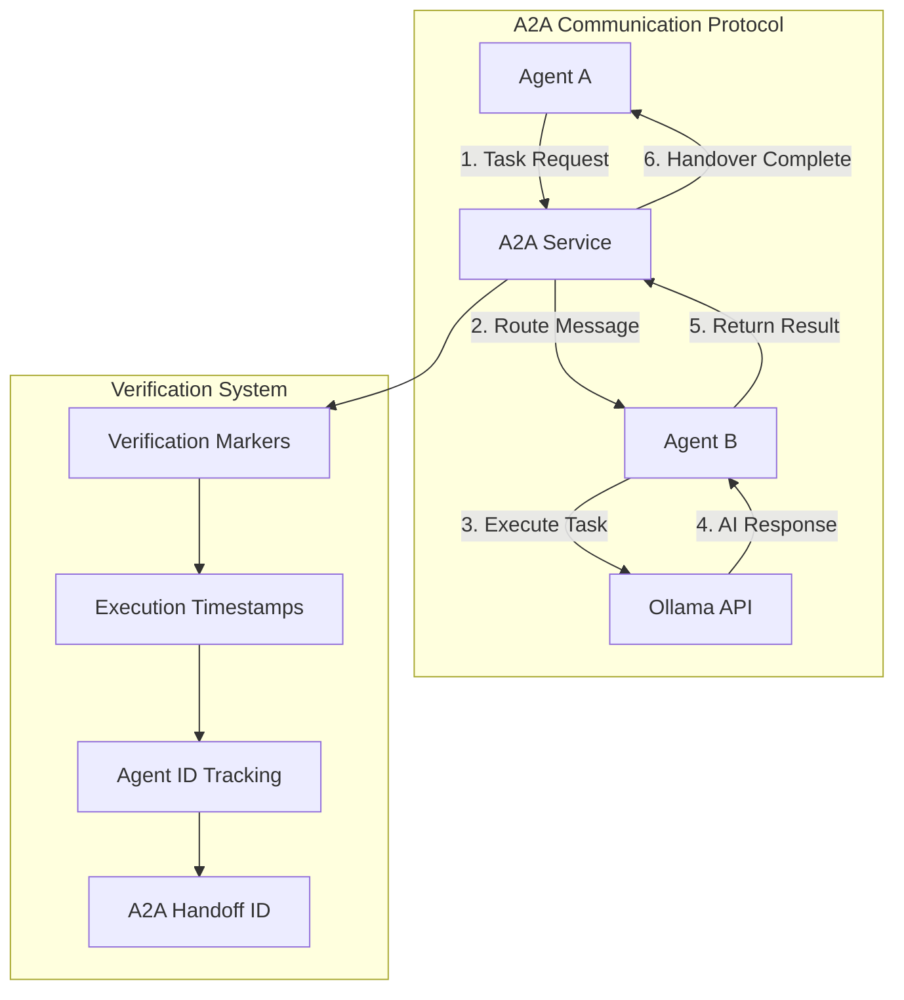
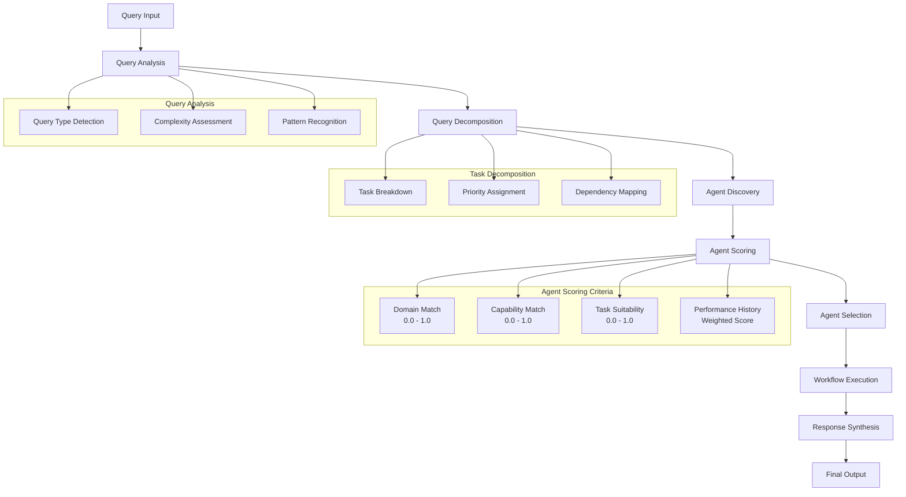
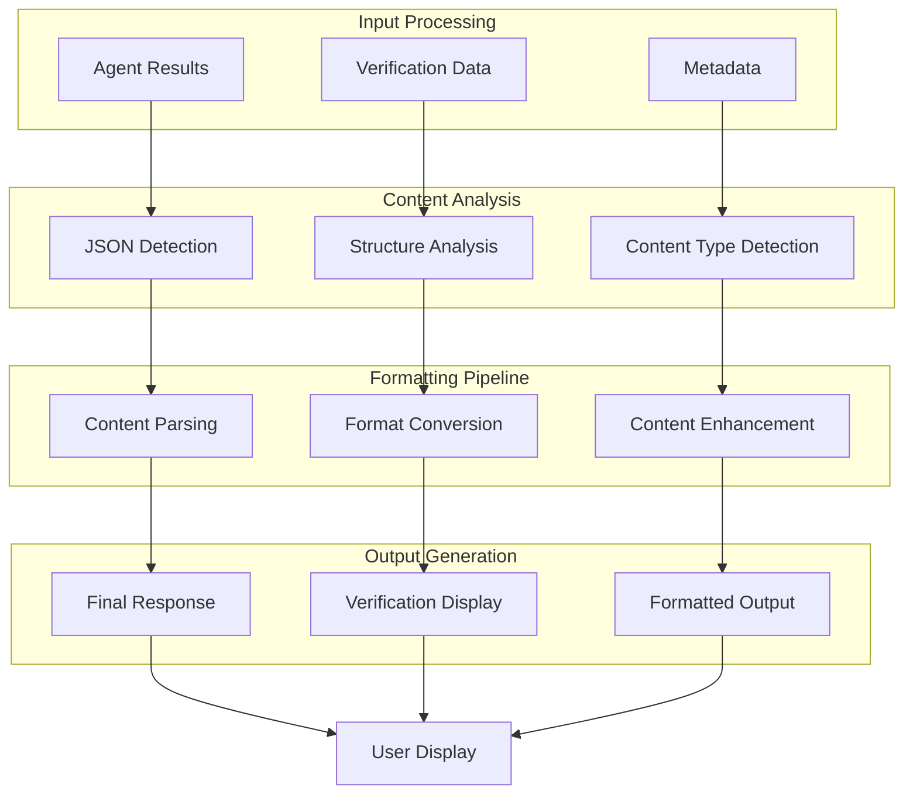
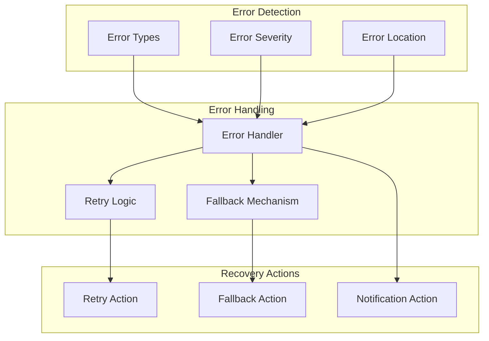

# AgentOS Studio Strands - Workflow Diagrams

## 🔄 Complete System Workflow

### Multi-Agent Orchestration Workflow

## 🤖 A2A Communication Workflow

### Agent-to-Agent Communication Protocol

## 🎯 Agent Selection Workflow

### Intelligent Agent Selection Process

## 📊 Response Processing Workflow

### Response Synthesis and Formatting

## 🔄 Error Handling Workflow

### Error Recovery and Fallback

---

*These workflow diagrams show the complete flow of the AgentOS Studio Strands system, from query processing to final response delivery.*